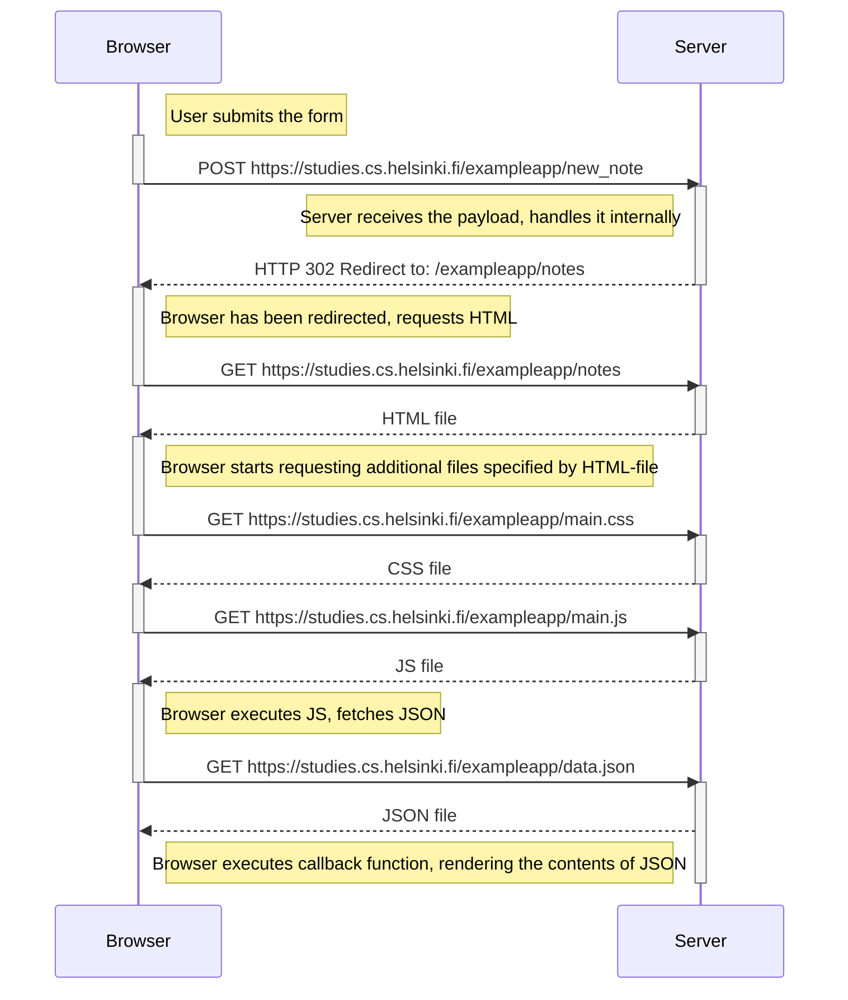

```mermaid
sequenceDiagram
    participant Browser
    participant Server
    Note right of Browser: User submits the form
    activate Browser
    Browser->>Server: POST https://studies.cs.helsinki.fi/exampleapp/new_note
    deactivate Browser
    activate Server
    Note left of Server: Server receives the payload, handles it internally
    Server-->>Browser: HTTP 302 Redirect to: /exampleapp/notes
    deactivate Server
    activate Browser
    Note right of Browser: Browser has been redirected, requests HTML 
    Browser->>Server: GET https://studies.cs.helsinki.fi/exampleapp/notes
    deactivate Browser
    activate Server
    Server-->>Browser: HTML file
    deactivate Server
    activate Browser
    Note right of Browser: Browser starts requesting additional files specified by HTML-file
    Browser->>Server: GET https://studies.cs.helsinki.fi/exampleapp/main.css
    deactivate Browser
    activate Server
    Server-->>Browser: CSS file
    deactivate Server
    activate Browser
    Browser->>Server: GET https://studies.cs.helsinki.fi/exampleapp/main.js
    deactivate Browser
    activate Server
    Server-->>Browser: JS file
    deactivate Server
    activate Browser
    Note right of Browser: Browser executes JS, fetches JSON
    Browser->>Server: GET https://studies.cs.helsinki.fi/exampleapp/data.json
    deactivate Browser
    activate Server
    Server-->>Browser: JSON file
    Note right of Browser: Browser executes callback function, rendering the contents of JSON
    deactivate Server
```
