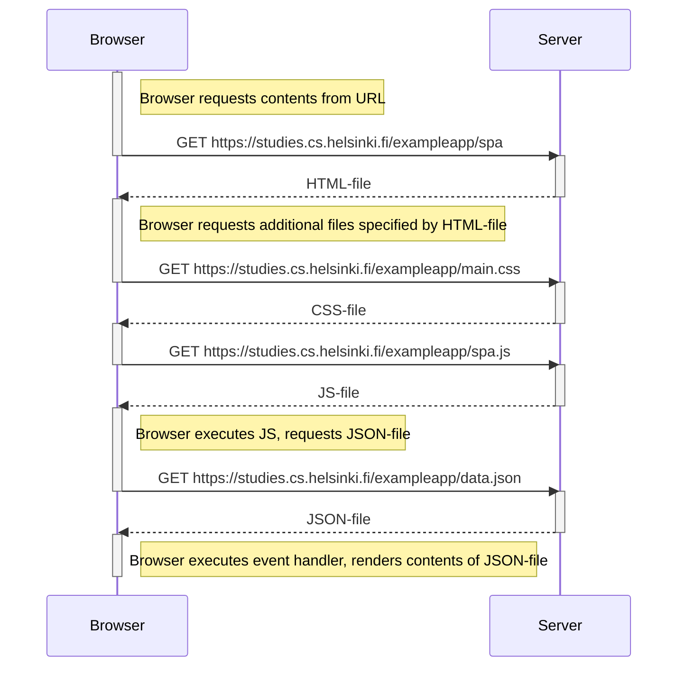

```mermaid
sequenceDiagram
    participant Browser
    participant Server
    activate Browser
    Note right of Browser: Browser requests contents from URL
    Browser->>Server: GET https://studies.cs.helsinki.fi/exampleapp/spa
    deactivate Browser
    activate Server
    Server-->>Browser: HTML-file
    deactivate Server
    activate Browser
    Note right of Browser: Browser requests additional files specified by HTML-file
    Browser->>Server: GET https://studies.cs.helsinki.fi/exampleapp/main.css
    deactivate Browser
    activate Server
    Server-->>Browser: CSS-file
    deactivate Server
    activate Browser
    Browser->>Server: GET https://studies.cs.helsinki.fi/exampleapp/spa.js
    deactivate Browser
    activate Server
    Server-->>Browser: JS-file
    deactivate Server
    activate Browser
    Note right of Browser: Browser executes JS, requests JSON-file
    Browser->>Server: GET https://studies.cs.helsinki.fi/exampleapp/data.json
    deactivate Browser
    activate Server
    Server-->>Browser: JSON-file
    deactivate Server
    activate Browser
    Note right of Browser: Browser executes event handler, renders contents of JSON-file
    deactivate Browser
```
