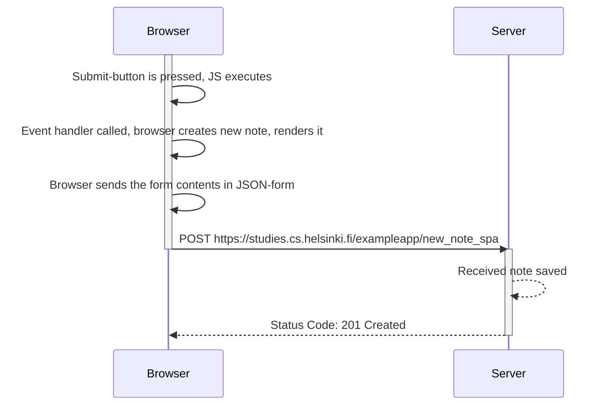

```mermaid
sequenceDiagram
    participant Browser
    participant Server
    activate Browser
    Browser->>Browser: Submit-button is pressed, JS executes
    Browser->>Browser: Event handler called, browser creates new note, renders it
    Browser->>Browser: Browser sends the form contents in JSON-form
    Browser->>Server: POST https://studies.cs.helsinki.fi/exampleapp/new_note_spa
    deactivate Browser
    activate Server
    Server-->>Server: Received note saved
    Server-->>Browser: Status Code: 201 Created
    deactivate Server
```
